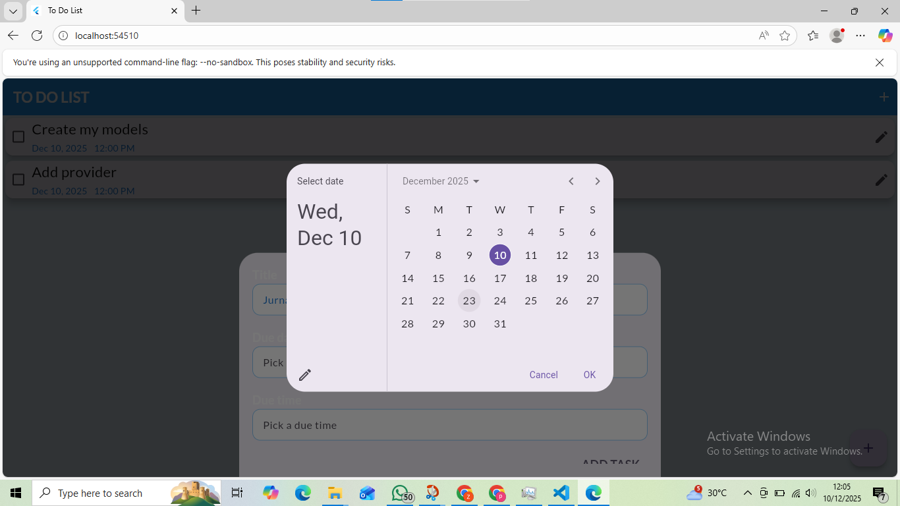
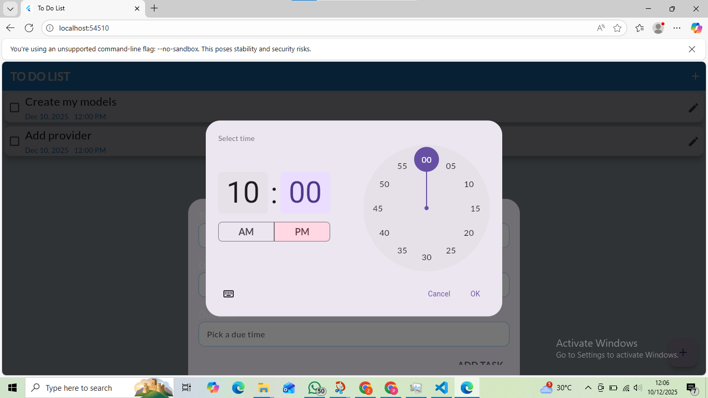
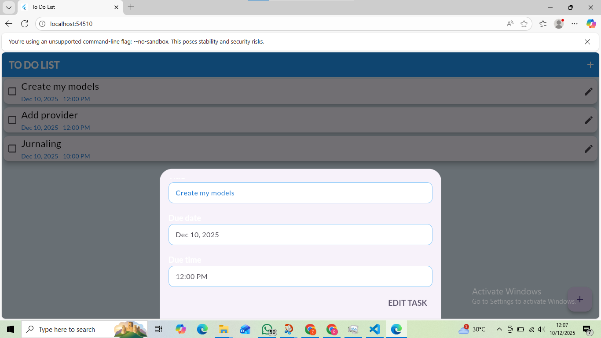

# Nama : Zweta Tri Rahma
# NIM: 14022300042

## Keterangan Aplikasi
Aplikasi Do List untuk mencatat dan mengatur aktivitas harian dengan mudah. Dibangun menggunakan Flutter, aplikasi ini berfokus pada kemudahan penggunaan, pengaturan waktu, dan pengelolaan aktivitas yang praktis.

## Fitur Utama
	•	✨ Tambah Aktivitas (Create Task) — Buat aktivitas baru dengan cepat
	•	✏ Edit Aktivitas — Ubah nama atau detail aktivitas kapan saja
	•	📅 Atur Tanggal & Hari — Tentukan kapan aktivitas dilakukan
	•	⏰ Atur Jam — Pilih waktu spesifik untuk setiap aktivitas
	•	✅ Checklist Aktivitas — Tandai aktivitas sebagai selesai
	•	🗑 Hapus Aktivitas — Bersihkan task yang tidak diperlukan
	•	💾 Auto Save — Data tersimpan otomatis (mis. dengan Provider)

## Instalasi Aplikasi Flutter dengan Script Bash*

# 1. Clone Repository
```bash
git clone <URL_REPOSITORY>
cd <NAMA_FOLDER_PROJECT>
```

# 2. Install Dependencies
```bash
flutter pub get
```


# 3. Jalankan Aplikasi
```bash
flutter run
```

## Tampilan Aplikasi



